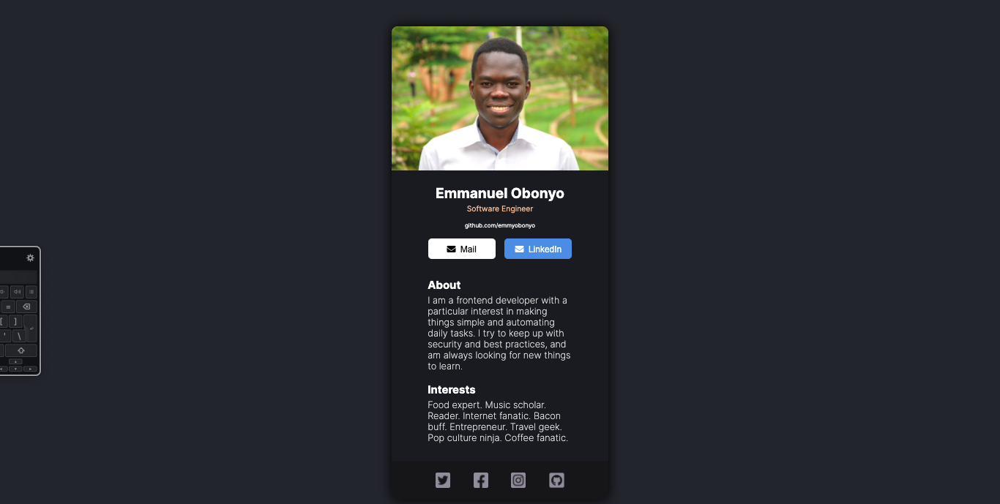

# Digital Identification App

> A card introducing myself.



- This is the full display of the App

## Built With

- JSX, CSS
- React

# Set Up
## Clone This Repository
```
$ git clone https://github.com/emmyobonyo/digital-business-card.git
$ cd digital-business-card
$ git checkout development
```
- Add this file [`.eslintrc.json`](https://github.com/microverseinc/linters-config/blob/master/react-redux/.eslintrc.json) to your root directory (the one that has your node modules folder). Don't forget to add the `.` at the begining.

## Run Project
```
$ npm install
$ npm start
```

## Run APP in the Broswer
- Open [http://localhost:3000](http://localhost:3000) to view it in your browser.

## Original Figma file
- https://www.figma.com/file/ISYGvCdElbFtBs4oDESymB/Digital-Business-Card-(Copy)

## Authors
👤 **Emmanuel Obonyo**

- GitHub: [@emmyobonyo](https://github.com/emmyobonyo)
- Twitter: [@emmyobonyo](https://twitter.com/emmyobonyo)
- LinkedIn: [Emmanuel Obonyo](https://www.linkedin.com/in/emmanuel-obonyo-3728a2200/)
## 🤝 Contributing

Contributions, issues, and feature requests are welcome!

Feel free to check the [issues page](https://github.com/emmyobonyo/digital-business-card/issues).

## Show your support

Give a ⭐️ if you like this project!
